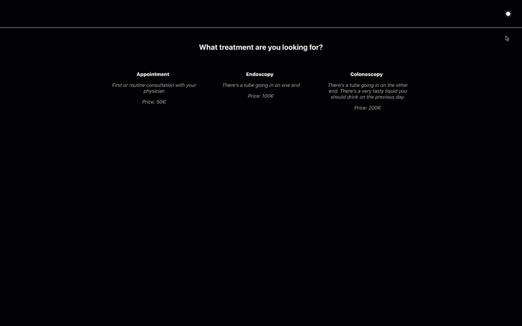

# Online Booking

Single Page Application to schedule appointments for a business, namely a medical center.
It is still a work in progress, I'm still going to:
- add an agenda management
- add a backend to it 
- improve some aspects of the frontend (see below)

## Running
In the project directory, you can run: \
`npm install` \
`npm start`\
If the browser does not open automatically, just go ahead and open 
[http://localhost:3000](http://localhost:3000) to view it in your browser.

## Improvements to work on
- use of databases would allow us to have variations between weekdays on different
  weeks (now, each doctor has a fixed set of slots)
- booking a slot does not change the json file in data; this will also be corrected
once the database is implemented
- calendar days should get faded out if no treatments available on them; this way, 
filtering doctors would have a visual effect on the calendar
- it could have smooth scrolling transition to each component that is triggered 
by the user actions. Consider using useRef()
- it could be a LOT easier on the eyes...but then again styling was not the major 
goal here

## Documentation
There's both a dark and light theme, switchable on the click of an icon on the 
nav.

There's essentially 3 steps on the booking process:
#### 1) TreatmentSelection: 
- This is the component that the user first sees, it's a radio button.
- You start by selecting a treatment. On selecting one, the components of the 
next step will be displayed. 
- You *can* change your selection, and it will affect the next step accordingly.

#### 2) SlotSelection:
- **SelectPractitioner:** checkbox that allows you to filter the practitioners
that perform the selected treatment. This filtering will affect the SelectHour 
component.
- **SelectDate:** calendar that allows you to select the date. Selecting a 
different weekday will show different results on SelectHour. \
*Note that I'm not (yet!) using any databases, just a simple JS object as data, 
so the variation is very limited. I opted to give them fixed time slots for fixed 
weekdays. This will be much more fluid when using databases.*
- **SelectHour:** table with the possible booking slots. Selecting one will take
you to the final form.

*There's plenty of packages of schedulers for react, and it would probably have 
sped up my work with the SelectHour component, but I think that would compromise
the goal of this exercise. I only used the calendar package, all the rest I did
from scratch.* 

#### 3) FinalForm:
You fill in the data, all fields are required.
In the end it shows a success message and outputs an object with all the data to
the console.
